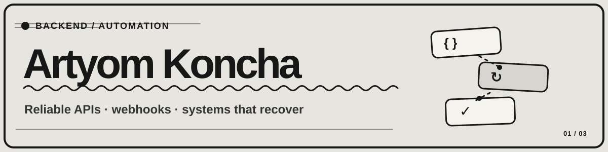

  

  <a href="https://artyom129.github.io/">Portfolio &amp; project stories</a> ·
  <a href="https://www.linkedin.com/in/artyom-python-automation/">LinkedIn</a> ·
  <a href="mailto:artyom129.x@gmail.com">Contact</a>

I build backend systems that keep working when requests fail, jobs retry, and integrations get messy. My work centers on **FastAPI, PostgreSQL, Redis, webhooks, background jobs, and automation**.

### Selected work

**[BACKPLANE](https://github.com/artyom129/backplane)**  
An operations control plane for API integrations, webhook delivery, background jobs, and incident response.  
`FastAPI` · `React` · `PostgreSQL` · `Redis`

**[QueueForge](https://github.com/artyom129/queueforge)**  
Distributed job processing with a transactional outbox, idempotency, retries, scheduling, and recovery.  
`Python` · `FastAPI` · `PostgreSQL` · `Redis`

**[TenantForge](https://github.com/artyom129/tenantforge)**  
A multi-tenant SaaS backend foundation with organization isolation, roles, API keys, quotas, and audit trails.  
`FastAPI` · `PostgreSQL` · `Redis` · `JWT`

**[Explore all six featured projects →](https://artyom129.github.io/#projects)**

### How I work

- **Make failures visible:** logs, metrics, delivery history, and audit trails.
- **Design for recovery:** retries, idempotency, dead-letter handling, and explicit states.
- **Keep systems understandable:** clear APIs and simple operational interfaces.

  <strong>Open to backend engineering and automation projects.</strong> 
  <a href="https://artyom129.github.io/">View the portfolio</a> · <a href="mailto:artyom129.x@gmail.com">Get in touch</a>

